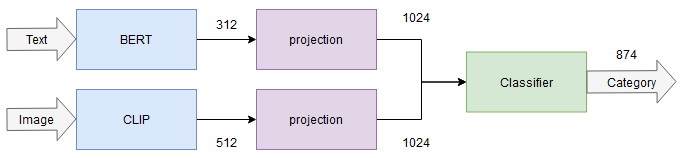

# Тестовое от KazanExpress (08.03.2023)
   
## Вводная информация
[Данные и условие задачи](https://remarkable-cockatoo-98b.notion.site/KazanExpress-d1c9915724544e1693afd0ca1b61a957)

|||
|:---|---|
|**Задача**| Предсказать категорию товара|
|**Тип задачи**|Многоклассовая классификация с дисбалансом классов. Всего **874** класса.|
|**Метрика**| F1-score weighted|
|**Данные**| Текстовое описание, картинки и табличные данные товаров. Всего **92,000** примеров.|

## Решение
+ Для валидации выделено 20% данных из *train*
+ Чтобы корректно работала стратификация данных, для категорий с одним примером (всего 4) продублированы данные.
+ Выполнена предобработка текстовых данных. Эмбеддинг текста генерируется из *названия магазина* и *описание товара*.
+ Проведены исследования различных архитектур нейросетей с одним входом (либо картинка, либо текст), а также с двойным входом (текст и картинка). Идея конкатенации эмбеддингов текста и картинки почерпнута из [статьи](https://www.researchgate.net/publication/347688606_Image_and_Text_fusion_for_UPMC_Food-101_using_BERT_and_CNNs).
+ В модели с двойным входом (лучшая модель) каждый блок, отвечающий за свою модальность, обучался отдельно, как самостоятельная модель. Далее обученные блоки конкатенируются с отбрасыванием последних слоев классификации, после чего добавлен общий слой классификации. 

## Multimodal model (Fusion model)

Модели трансформеров:
+ BERT - [cointegrated/rubert-tiny2](https://huggingface.co/cointegrated/rubert-tiny2)
+ CLIP - [openai/clip-vit-base-patch32](https://huggingface.co/openai/clip-vit-base-patch32)

## Результаты исследований
|Модель|Модальность|f1-train|f1-val|
|:---|:---:|:---:|:---:|
|ComplementNB, TF-IDF (Baseline)|Text|0.7824|0.6972|
|MLP|Text|0.9437|0.8465|
|CNN|Text|0.9411|0.8563|
|LSTM|Text|0.8715|0.8665|
|BERT|Text|0.8996|0.8745|
|Efficientnet_b1|Image|0.4741|0.4594|
|CLIP|Image|0.6293|0.5665|
|BERT+CLIP|Text+Image|0.9209|**0.8842**|

